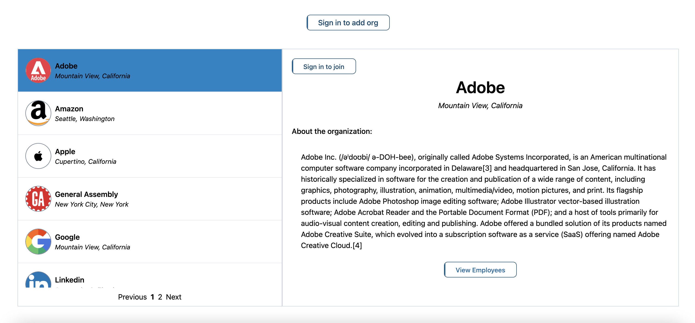
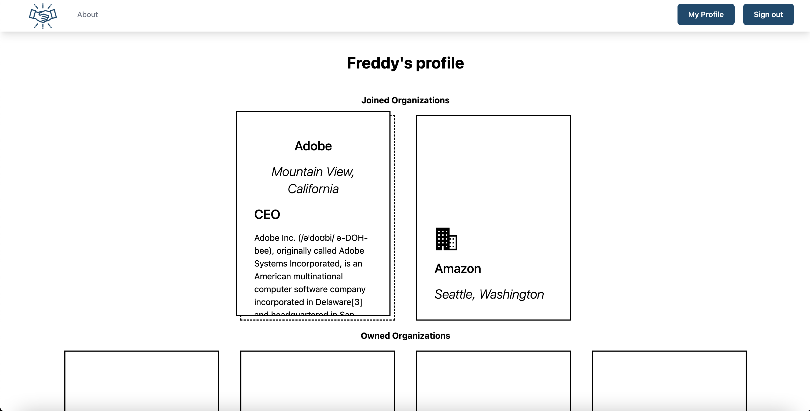

# **assembly-api**
## **Date**: 03/24/2023
[LinkedIn](https://www.linkedin.com/in/frederickcaione)

[Deployed App](https://assembly-react.netlify.app/)
***
### ***Description***
Assembly is an app designed for professional connection. Connect with people from your alma mater or your dream company, set up virtual coffee-dates, and explore their journey into their professional field. Created to detatch from the world of social media when it comes to building professional connections; No posts, no likes, just users. Schedule your video chat with your ideal company, coming soon

***

### ***Technologies Used***
* Flask
* FlaskSQLAlchemy
* React
* CSS
    * Tailwind

***

### ***Screenshots***

***

### ***Future Updates***
* [ ] Video chat/instant messenger using socket.io/WebRTC
* [ ] Ability to search companies/users

***

### ***Credits***

Project notion board: [Notion](https://chalk-salute-242.notion.site/c5b52023a6da419d9f55179a433799f1?v=e72d9204238d4a3c8c2ce620e423a695)

Components Diagram: [lucid.io](https://lucid.app/documents/view/ddbcb159-157b-48f7-8576-deb2c4eae240)
